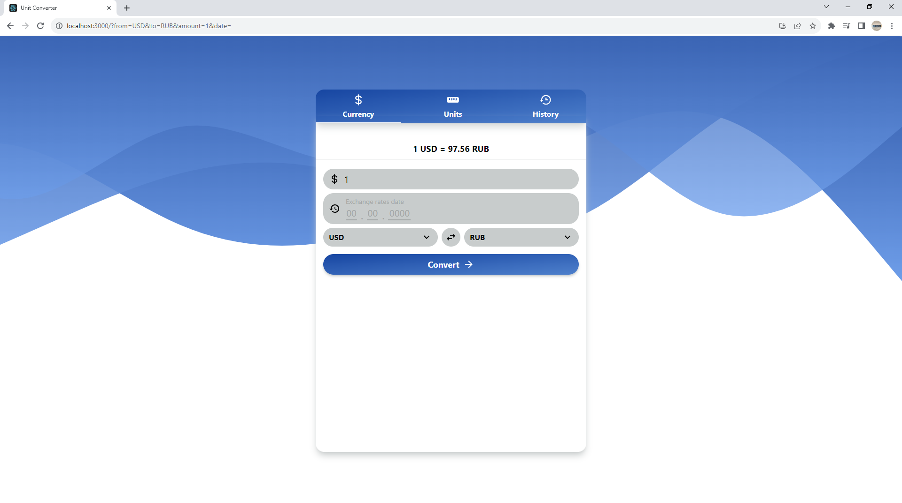
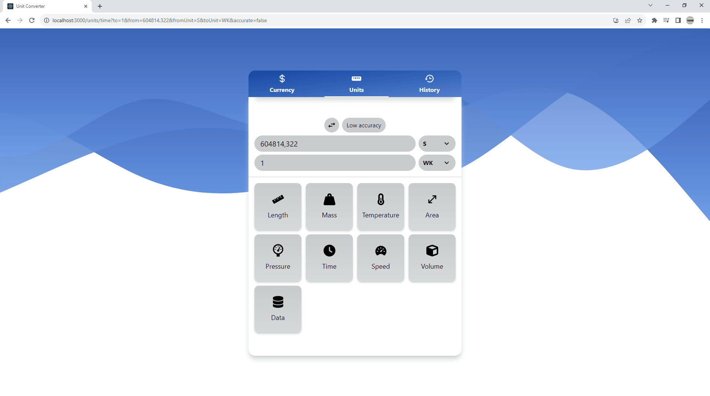

<<<<<<< HEAD

## Unit Currency Converter

**Unit Currency Converter** is a React application for converting currencies and units of measurement.

You can convert over 30 currencies, make historical conversions, and view conversion history. **The app also has 9 unit converters**.

[Try the app demo](https://unit-currency-converter.vercel.app/) running on Vercel.

## Application demo





## Installation

1. Install Node.js _(in case you haven't installed it)_.
2. [Download the source code](https://github.com/IhorAntiukhov/unit-currency-converter.git) and open a command prompt in the project's root folder.
3. Install the dependencies needed for the application.

```
npm install
```

4. Start React project and development server.

```
npm start
```

## Libraries and tools

This app was built using **Create React App**, **Redux Toolkit**, **Tailwind CSS**, **React Router**, **Redux Persist**, **React Icons** and **Class Names** library.
